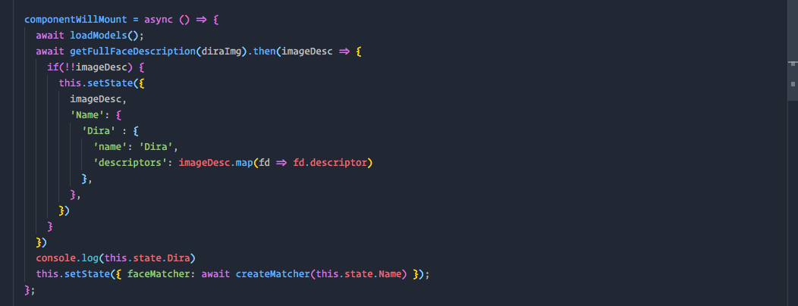
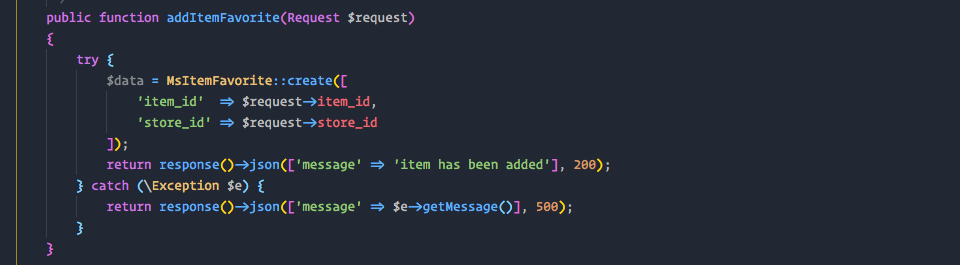

## Make your VSCODE prettier

hello guys, i want to share my vscode setup for productivity. so if you interesting you can clone this
repository and read this to make your vscode prettier.

**Javascript**

**Laravel**

## how to install

- Download fonts and install all fonts. there's 2 font style in directory font.
- for theme, i using One Dark Theme, my favorite theme :D
- done. your vscode very beautifull

## My Extensions for productivity

- Auto Close Tag [download](https://marketplace.visualstudio.com/items?itemName=formulahendry.auto-close-tag)
- Auto Rename Taf [download](https://marketplace.visualstudio.com/items?itemName=formulahendry.auto-rename-tag)
- Babel ES6/ES7 for javascript development [download](https://marketplace.visualstudio.com/items?itemName=dzannotti.vscode-babel-coloring)
- Beautify [download](https://marketplace.visualstudio.com/items?itemName=HookyQR.beautify)
- Bracket Pair Colorizer 2 [download](https://marketplace.visualstudio.com/items?itemName=CoenraadS.bracket-pair-colorizer)
- ESlint for javascript development [download](https://marketplace.visualstudio.com/items?itemName=dbaeumer.vscode-eslint)
- GitLens for view last commit and push code to github [download](https://marketplace.visualstudio.com/items?itemName=eamodio.gitlens)
