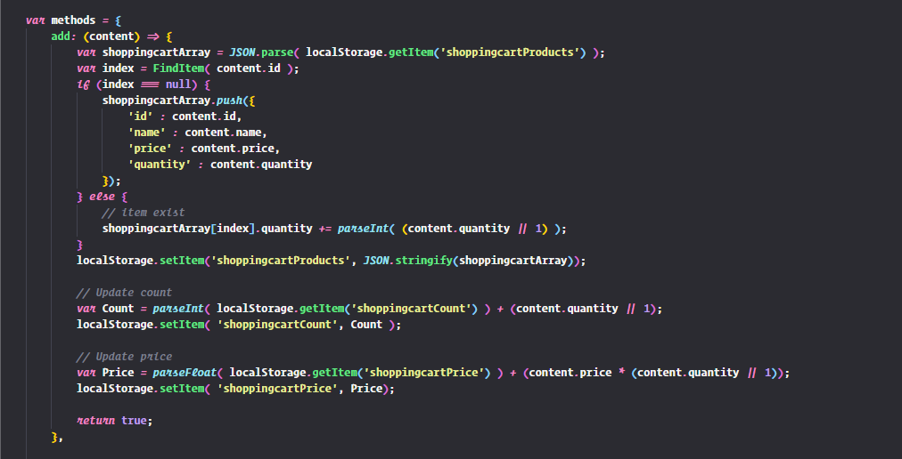
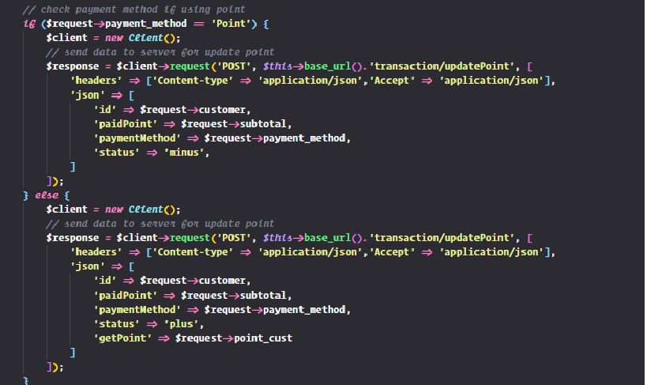

## Operator Mono Ligature VSCODE

** Javascript **

** Laravel **

** Python **

## how to install
- Download fonts and install all fonts
- open Setting json vscode and look my setting vscode. You can use my setting.
- install theme Dracula from vscode store
- install CSS and JS loader
- done. your vscode very beautifull